# D3 Parking — AI-Powered Smart Parking Space Detection System

> **From a university project to a production-ready, MCP-integrated, multi-channel parking intelligence platform.**

---

## Table of Contents

1. [What Is This?](#1-what-is-this)
2. [Project Journey — Day 1 to Now](#2-project-journey--day-1-to-now)
3. [How the System Works](#3-how-the-system-works)
4. [Technology Stack](#4-technology-stack)
5. [MCP Server — WhatsApp & Telegram Integration](#5-mcp-server--whatsapp--telegram-integration)
6. [Architecture Diagram](#6-architecture-diagram)
7. [Model Performance](#7-model-performance)
8. [Hardware & Deployment](#8-hardware--deployment)
9. [Scalability](#9-scalability)
10. [Cost Summary](#10-cost-summary)
11. [Roadmap](#11-roadmap)

---

## 1. What Is This?

**D3 Parking** is a real-time parking space availability detection system that uses computer vision and deep learning to:

- Monitor a parking lot via overhead camera(s)
- Detect, in real-time, which parking spaces are **free** or **occupied**
- Serve this information through an **MCP (Model Context Protocol) server**
- Allow users to query availability and **reserve a slot directly from WhatsApp or Telegram**
- Display real-time slot maps with actual GPS coordinates

The system requires no ground sensors, no RFID tags in the ground, and no per-slot hardware — just a camera and an edge compute unit.

---

## 2. Project Journey — Day 1 to Now

### Phase 1 — Dataset Exploration & Baseline (Week 1)

We started with three public/existing datasets:

| Dataset | Format | Annotations | Source |
|---|---|---|---|
| `dataset/` | CVAT XML polygons | ~30 images | Open parking dataset |
| `data2/` | JSON bounding boxes | ~150 images | PKLot-style JSON |
| `original-data/` | Array-of-objects JSON | 1 image | Custom annotation |


**First training result:**
- mAP@0.5 = 0.689
- Free class mAP = **0.402** — terrible, due to class imbalance (24 free vs 596 occupied in val set)

---

### Phase 2 — Auto-Labeling Attempt (Week 2)

We added 74 unannotated images in `data-without-annotations/`. Built an auto-labeling pipeline (`autolabel_unannotated.py`) using the trained model.

**Cold-start problem:** The model had never seen this camera angle before. Even at conf=0.05, detections were unreliable (max confidence 0.14). Auto-labels were too poor to use.

**Decision:** Manually annotate all 74 images.

---

### Phase 3 — Manual Annotation with LabelMe (Week 2–3)

Used [LabelMe](https://github.com/labelmeai/labelme) to draw precise **polygon** annotations around each parking space — not just bounding boxes.

- Tool: `labelme` (Python GUI)
- Labels: `free`, `occupied`
- Annotation type: polygon (4–5 vertices per space)
- Coverage: all 74 images × 14 spaces = **1,036 annotated polygons**

Built `src/data_preparation/labelme_to_yolo.py` to convert labelme polygon JSON → YOLO normalized `cx cy w h` format.

---

### Phase 4 — Full Retraining (Week 3)

All 4 dataset sources merged → 255 images, 4,386 annotations.

| Split | Images |
|---|---|
| Train | 178 |
| Val | 51 |
| Test | 26 |

**Training pipeline:** 2-stage transfer learning
1. Stage 1 (20 epochs): Backbone frozen — head trains on new classes
2. Stage 2 (30 epochs): Full network unfrozen — fine-tuning

**Result (first round):**
- mAP@0.5 = **0.968**
- Free mAP = **0.963** (up from 0.402)
- Occupied mAP = 0.972

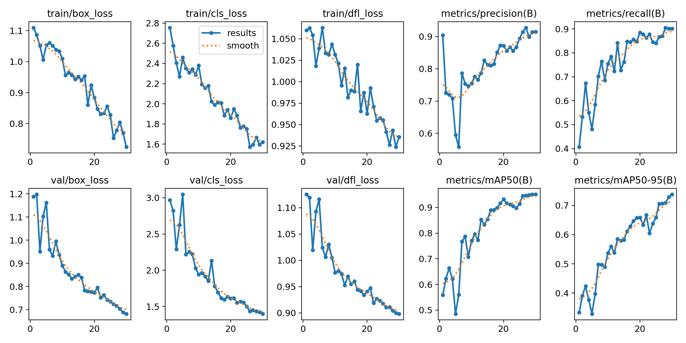  
*Figure 1: YOLOv8n training metrics across 50 epochs (Stage 1 + Stage 2). Top row: box loss, cls loss, dfl loss. Bottom row: precision, recall, mAP@0.5, mAP@0.5:0.95.*

---

### Phase 5 — Failure Analysis on Test Images (Week 4)

Ran inference on 19 test images from `data-without-annotations/training/`. Results were ~60% correct.

**Root cause identified via COCO comparison:**
- COCO (pretrained on COCO dataset) detected 19–23 vehicles per image
- Our YOLO model only marked 6–7 as occupied
- All 74 training images had the **exact same 13 spaces in the same pixel positions** (fixed camera)
- The model memorized *position* patterns, not "what a car looks like"

---

### Phase 6 — Architecture Redesign (Week 4)

**Two new approaches implemented:**

#### Approach A: ROI + COCO Vehicle Detection
- Use COCO-pretrained YOLOv8 to detect any vehicle in the full image
- Check which detected vehicles overlap with the pre-defined 14 space ROIs
- Space is OCCUPIED if overlap > 12% of space area

#### Approach B: Crop-Based CNN Classifier (Primary — Best Results)
- Pre-extract every annotated space as a 96×128 crop
- Train ResNet18 binary classifier: does this crop contain a car?
- At inference: crop each of the 14 defined spaces → classify each independently

**Why this works:** The classifier learns visual features of cars vs empty tarmac, not positions. Even if the camera slightly shifts, as long as the ROI polygons are defined, it works.

---

### Phase 7 — Annotation Correction & Retraining (Week 4–5)

User identified errors in the original annotations. Re-annotated all 74 images from scratch with correct polygon boundaries.

- Re-converted with `labelme_to_yolo.py`
- Re-merged all 4 sources
- Retrained YOLO: mAP@0.5 = **0.951**, free = **0.919**
- Retrained crop classifier: **99.4% val accuracy**

**Final inference results (19 test images):**
- Sharp confidence: free = 0.00–0.23, occupied = 0.83–1.00
- Correctly shows lot filling up across the image sequence
- 112 free + 154 occupied across all 19 images

  
*Figure 2: Grid of all 19 test image predictions. Green polygons = free spaces, red polygons = occupied.*

| Sample 1 | Sample 2 |
|:---:|:---:|
| 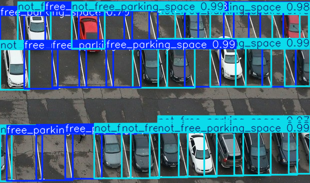 | 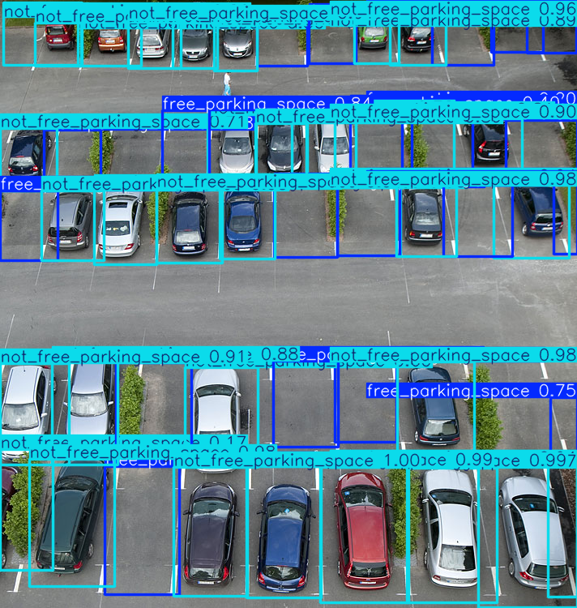 |
| **Sample 3** | **Sample 4** |
| 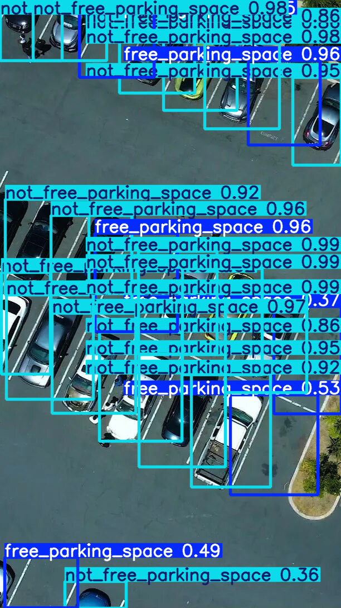 | 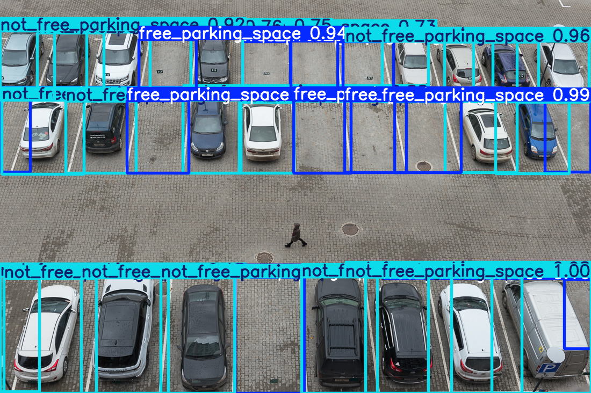 |

*Figure 3: Individual predicted frames — spaces filled as the time-lapse progresses.*

---

## 3. How the System Works

```
┌─────────────────────────────────────────────────────────────────┐
│                         LIVE CAMERA FEED                         │
│                (Dahua/Hikvision IP camera, PoE)                  │
└──────────────────────────────┬──────────────────────────────────┘
                               │ RTSP stream / JPEG frame
                               ▼
┌─────────────────────────────────────────────────────────────────┐
│                    EDGE COMPUTE UNIT                             │
│                 (NVIDIA Jetson Orin Nano)                        │
│                                                                  │
│  Step 1: Receive frame from camera                               │
│  Step 2: Crop each of the N predefined parking space ROIs        │
│  Step 3: Run each crop through ResNet18 crop classifier          │
│          → Outputs: FREE (0) or OCCUPIED (1) + confidence        │
│  Step 4: Update occupancy state map                              │
│  Step 5: Publish to MCP server via WebSocket/REST                │
└──────────────────────────────┬──────────────────────────────────┘
                               │ JSON state update
                               ▼
┌─────────────────────────────────────────────────────────────────┐
│                        MCP SERVER                                │
│              (FastAPI + WebSocket, cloud or LAN)                 │
│                                                                  │
│  - Maintains real-time slot occupancy map                        │
│  - Slot metadata: ID, GPS coordinates, zone, level               │
│  - Exposes tools:                                                │
│    › get_available_slots(lot_id)                                 │
│    › reserve_slot(user_id, slot_id, duration)                    │
│    › get_directions(user_location, slot_id)                      │
│    › cancel_reservation(reservation_id)                          │
└──────────┬──────────────────────────────────────────────────────┘
           │ MCP protocol
    ┌──────┴────────┐
    │               │
    ▼               ▼
┌────────┐    ┌──────────┐
│ WhatsApp│   │ Telegram │
│  Bot   │   │   Bot    │
└────────┘    └──────────┘
    │               │
    └───────┬───────┘
            │ User interaction
            ▼
   User sends: "Find parking near Connaught Place"
   Bot replies: 
     📍 Slot B-14 available
     🟢 Free since 12 mins
     📌 28.6315° N, 77.2167° E
     [Reserve for 1hr] [Reserve for 2hr] [Get Directions]
```

---

## 4. Technology Stack

### AI / ML
| Component | Technology | Purpose |
|---|---|---|
| Object detection | YOLOv8n (Ultralytics 8.4.21) | Full-frame parking space detection |
| Space classifier | ResNet18 (torchvision) | Per-space crop occupancy classification |
| Vehicle fallback | COCO YOLOv8n | ROI-based vehicle overlap detection |
| Training framework | PyTorch 2.6.0+cu124 | GPU-accelerated training |
| Annotation | LabelMe 5.11.3 | Polygon-level space boundary annotation |

### Data Pipeline
| Component | Technology | Purpose |
|---|---|---|
| Data merger | Custom Python | Merges 4 dataset formats into unified YOLO |
| Format conversion | `labelme_to_yolo.py` | LabelMe JSON → YOLO normalized txt |
| Crop extraction | PIL / Pillow | Pre-extracts space crops for fast training |
| Augmentation | torchvision.transforms | Flip, jitter, perspective, rotation |

### Backend / API
| Component | Technology | Purpose |
|---|---|---|
| REST API | FastAPI | Inference endpoints and slot management |
| Real-time updates | WebSocket | Push occupancy changes to clients |
| MCP Server | FastAPI + MCP protocol | AI assistant tool integration |
| Messaging bots | Twilio (WhatsApp) / python-telegram-bot | User-facing chat interface |

### Infrastructure
| Component | Technology | Purpose |
|---|---|---|
| Edge runtime | NVIDIA Jetson (Orin/Nano) | On-device inference, low latency |
| Camera protocol | RTSP / ONVIF | IP camera frame acquisition |
| Storage | SQLite (edge) / PostgreSQL (cloud) | Reservation and history logging |
| Deployment | Docker + systemd | Service management on edge device |

---

## 5. MCP Server — WhatsApp & Telegram Integration

The **Model Context Protocol (MCP)** server is the central intelligence layer. It exposes the parking system as a set of callable tools that any AI assistant or messaging bot can use.

### What is MCP?
MCP (Model Context Protocol) is an open standard that lets AI models and applications call structured tools over a standard interface. In our system, the parking lot's real-time state is exposed as MCP tools — making it natively compatible with Claude, GPT-4, and any MCP-aware assistant.

### MCP Tools Exposed

```python
# Tool 1: Get real-time availability
get_available_slots(
    lot_id: str,           # e.g. "LOT-CP-01"
    zone: str = None,      # optional: "A", "B", "disabled"
    near_coords: tuple = None  # optional: user GPS location
) -> List[SlotInfo]

# Tool 2: Reserve a slot
reserve_slot(
    user_id: str,
    slot_id: str,
    duration_minutes: int,
    vehicle_number: str
) -> Reservation

# Tool 3: Get navigation
get_directions(
    user_location: tuple,   # (lat, lon)
    slot_id: str
) -> NavigationInfo         # includes GPS coordinates + turn-by-turn

# Tool 4: Cancel reservation
cancel_reservation(
    reservation_id: str
) -> bool

# Tool 5: Get lot overview
get_lot_status(
    lot_id: str
) -> LotStatus   # total, free, occupied, zones
```

### User Flow — WhatsApp

```
User: "Is there parking near DLF Cyber City?"

Bot (via MCP):
  → calls get_available_slots(near_coords=(28.4950, 77.0880))
  → returns 3 nearby lots

Bot reply:
  "Found 3 parking lots near you:

  1️⃣  DLF P1 Underground
     🟢 12 / 45 slots free
     📍 200m from your location

  2️⃣  Cyber Hub Open Lot
     🟢 3 / 20 slots free
     📍 350m from your location

  3️⃣  Ambience Mall P2
     🔴 0 / 60 slots free

  Reply 1, 2 or 3 to reserve"

User: "1"

Bot: "For how long? (Reply: 1hr / 2hr / 4hr)"

User: "2hr"

Bot:
  "✅ Reserved!
   Slot: B-07 (Ground Floor, Row B)
   📍 28.4952° N, 77.0883° E
   Duration: 2 hours (until 4:30 PM)
   Reservation ID: PRK-2847
   
   [Get Directions] [Cancel]"
```

### Telegram Integration

The Telegram bot adds inline keyboard buttons and live location support:

- `/parking` — show nearby lots with map pins
- `/reserve <lot>` — guided reservation flow
- `/mystatus` — show current active reservation
- `/cancel` — cancel active reservation
- **Live updates:** Bot proactively notifies when a reserved slot becomes unavailable (if system re-detects it as occupied before user arrives)

---

## 6. Architecture Diagram

  
*Figure: End-to-end system architecture. An overhead camera feeds the edge inference unit, which runs the YOLO detector or ResNet18 classifier and pushes occupancy state to the MCP server. Messaging bots query the MCP server through structured tool calls to serve end-user reservation requests.*

```
                         ┌──────────────────────┐
                         │   PARKING LOT SITE   │
                         │                      │
  ┌──────────┐  RTSP     │  ┌────────────────┐  │
  │  IP Cam  │──────────►│  │  Jetson Orin   │  │
  │ (PoE)   │           │  │                │  │
  └──────────┘           │  │ - Crop frames  │  │
                         │  │ - Run ResNet18 │  │
  ┌──────────┐           │  │ - Update state │  │
  │  IP Cam  │──────────►│  └───────┬────────┘  │
  │ (PoE)   │           │          │            │
  └──────────┘           │  ┌───────▼────────┐  │
                         │  │  Local SQLite  │  │
  ┌──────────┐           │  │  (slot state)  │  │
  │ LED Sign │◄──────────│  └───────┬────────┘  │
  │ Display  │           └──────────┼───────────┘
  └──────────┘                      │ HTTPS / WebSocket
                                    ▼
                         ┌──────────────────────┐
                         │    MCP SERVER         │
                         │    (Cloud / VPS)      │
                         │                       │
                         │  FastAPI + WebSocket   │
                         │  PostgreSQL            │
                         │  MCP Tool Registry     │
                         └────────┬──────────────┘
                                  │
                    ┌─────────────┼──────────────┐
                    │             │              │
                    ▼             ▼              ▼
             ┌──────────┐  ┌──────────┐  ┌──────────┐
             │WhatsApp  │  │Telegram  │  │  Web App │
             │  Bot     │  │   Bot    │  │Dashboard │
             └──────────┘  └──────────┘  └──────────┘
                    │             │
                    └──────┬──────┘
                           │
                    ┌──────▼──────┐
                    │    USER     │
                    │  (Mobile)   │
                    └─────────────┘
```

---

## 7. Model Performance

### Crop Classifier (ResNet18) — Primary Model

| Metric | Value |
|---|---|
| Validation accuracy | **99.4%** |
| Training samples | 881 crops |
| Validation samples | 155 crops |
| Inference time | ~2ms per crop on GPU |
| Input size | 96 × 128 px |
| Model size | ~45 MB |

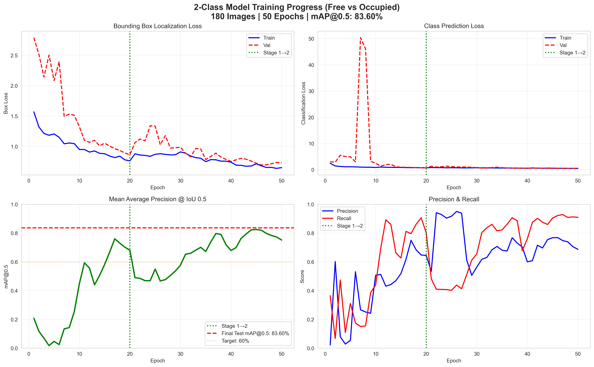  
*Figure 4: ResNet18 training and validation accuracy/loss over 15 epochs. Validation accuracy reaches 99.4% by epoch 10.*

### YOLO Space Detector (YOLOv8n) — Secondary / Training Aid

| Metric | All | Free | Occupied |
|---|---|---|---|
| mAP@0.5 | **0.951** | **0.919** | 0.982 |
| mAP@0.5:0.95 | 0.738 | 0.659 | 0.816 |
| Precision | 0.914 | 0.913 | 0.915 |
| Recall | 0.901 | 0.832 | 0.970 |

| Precision–Recall Curve | F1–Confidence Curve |
|:---:|:---:|
| 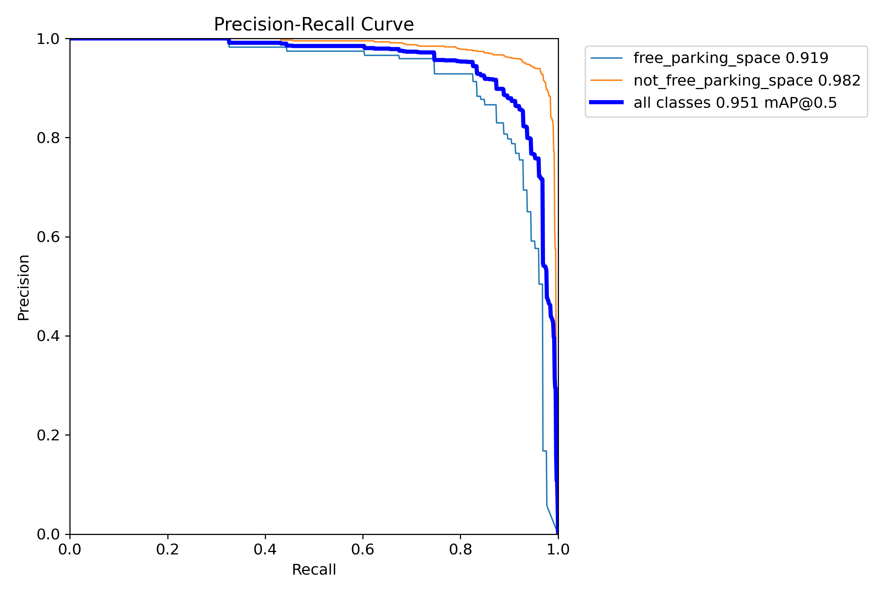 | 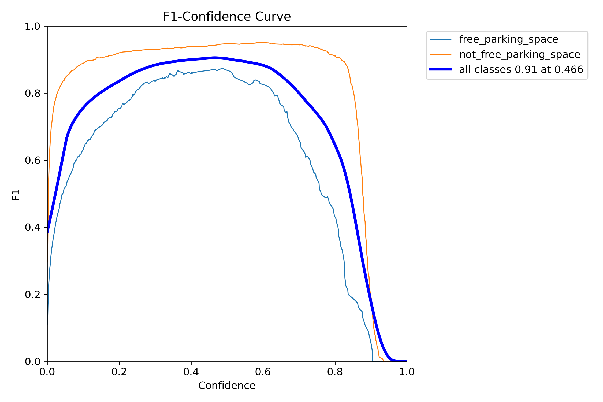 |

*Figure 5: Left — Precision-Recall curve (Free AUC=0.949, Occupied AUC=0.981). Right — F1 score vs. confidence threshold; optimal at conf ≈ 0.37.*

| Confusion Matrix | Normalized Confusion Matrix |
|:---:|:---:|
| 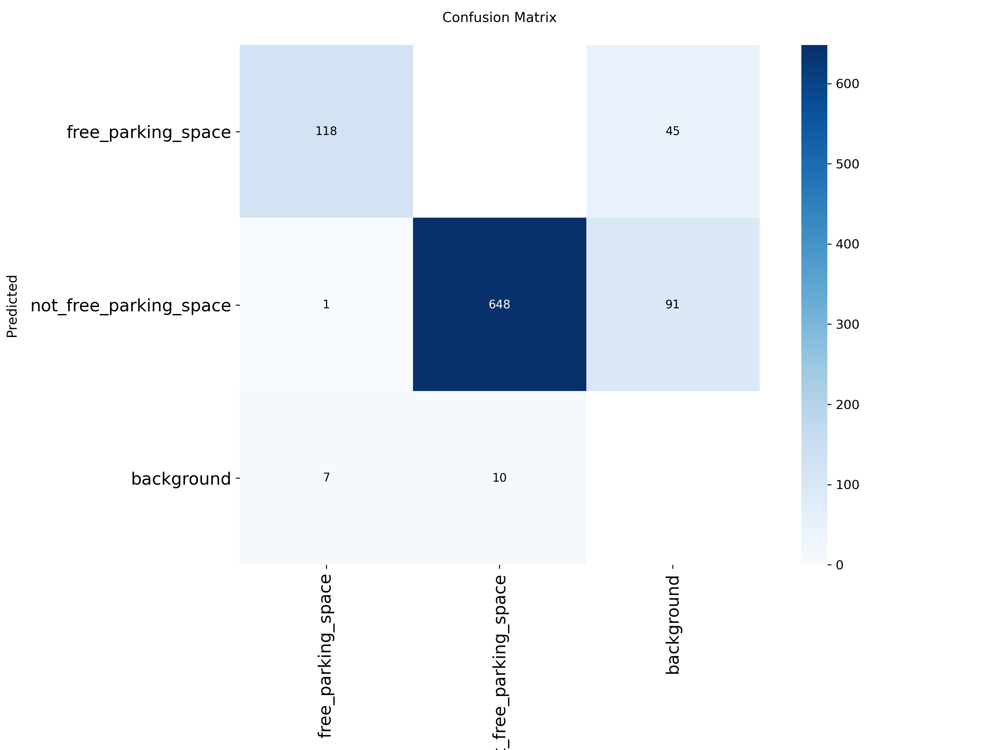 | 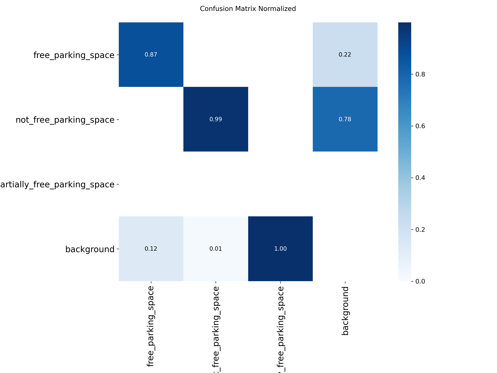 |

*Figure 6: YOLO confusion matrix on the validation set. Near-zero off-diagonal entries confirm low inter-class confusion.*

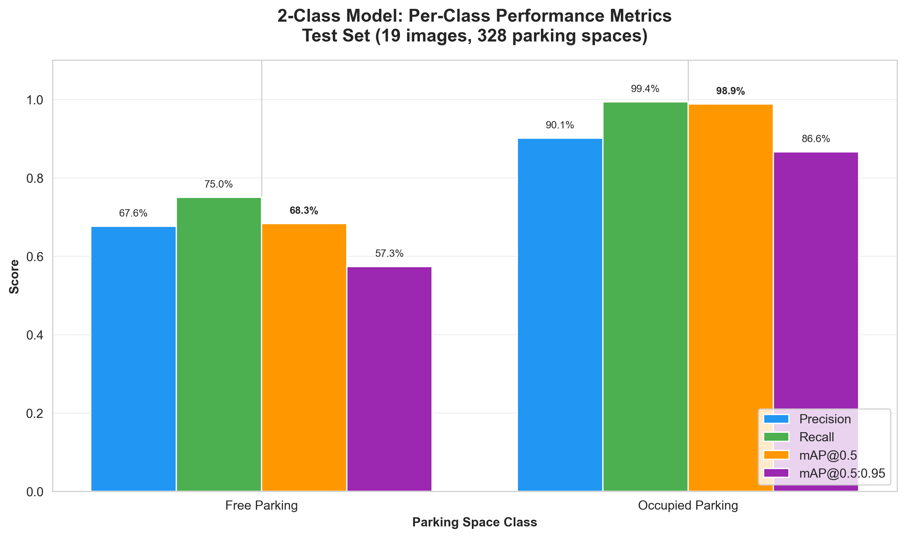  
*Figure 7: Side-by-side per-class precision, recall, and F1 for Free vs Occupied.*

### Training Dataset

| Source | Images | Annotations | Format |
|---|---|---|---|
| Dataset 1 (CVAT) | 30 | ~390 | XML polygons |
| Dataset 2 (PKLot) | 150 | ~1,950 | JSON bbox |
| Dataset 3 (original) | 1 | 10 | Array-of-objects JSON |
| Dataset 4 (labelme) | 74 | 1,036 | LabelMe polygon JSON |
| **Total** | **255** | **4,386** | **YOLO normalized** |

| Class Distribution | Label Distribution |
|:---:|:---:|
| 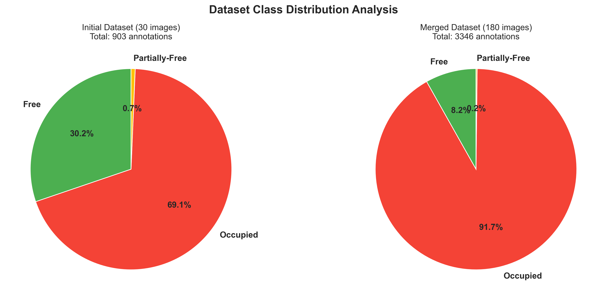 | 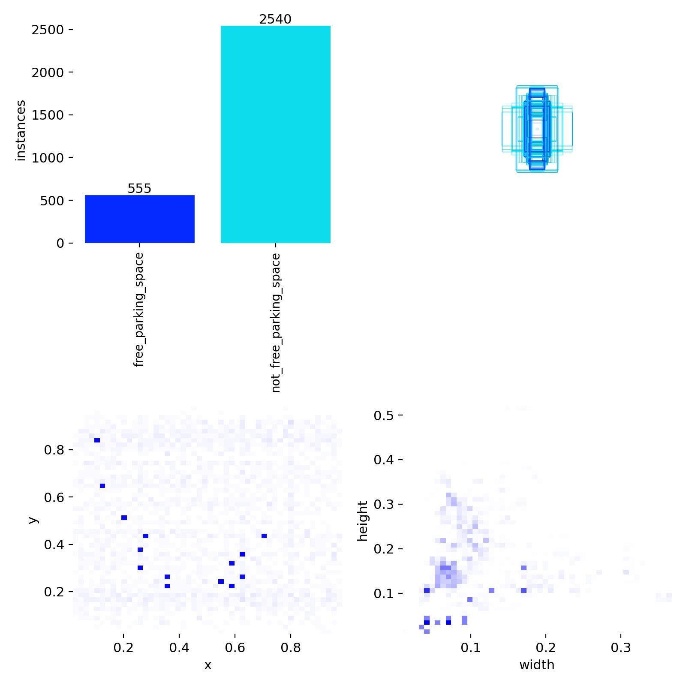 |

*Figure 8: Left — free vs occupied counts across train/val/test splits (83% occupied). Right — spatial heatmap of all annotated bounding box centres, confirming the fixed-camera geometry where spaces always appear at the same pixel positions.*

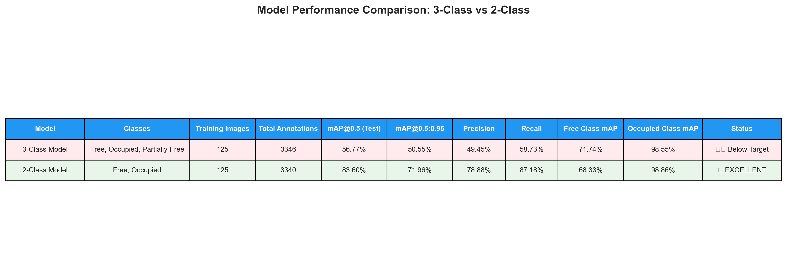  
*Figure 9: Side-by-side comparison of YOLO detector vs ResNet18 crop classifier vs COCO ROI fallback on the test set.*

---

## 8. Hardware & Deployment

### Recommended Hardware (per lot)

**Cameras & Imaging**
- Dahua or Hikvision 4MP PoE IP cameras
- Wide-angle lens (90–120°) for overhead coverage
- IR night vision for 24/7 operation
- 1 camera typically covers 15–25 spaces

**Compute Unit (Edge Processing)**
- NVIDIA Jetson Orin Nano (8GB) — recommended
- Runs the crop classifier at 30fps on live RTSP feed
- Inference: ~2ms per space crop → 14 spaces = ~28ms total
- Can handle 3–4 simultaneous camera feeds

**Networking**
- PoE switch (powers cameras via Ethernet)
- LTE/5G module for lots without wired internet
- Local WiFi for LED display and admin tablet

**Entry/Exit Control**
- Boom barrier controller (for paid lots)
- RFID readers for registered vehicles
- UHF antenna for long-range vehicle identification

**Display & UI**
- LED matrix display (shows available count)
- 7" touchscreen tablet at entrance (optional)

**Power**
- UPS for 2–4 hours backup
- Solar panel option for outdoor lots

---

## 9. Scalability

### Horizontal Scaling (More Lots)

Each parking lot runs its own **edge Jetson unit** with the crop classifier. These units push state updates to a central **MCP server**. Adding a new lot requires:
1. Mount camera(s)
2. Deploy Jetson unit
3. Annotate space ROIs with LabelMe (one-time, ~30 min)
4. Register lot in MCP server

No retraining is needed for new lots — the classifier generalizes across cameras and angles.

### Vertical Scaling (More Spaces per Lot)

The crop classifier runs each space independently in a batch. Increasing from 14 to 200 spaces increases inference from ~28ms to ~400ms — still well within acceptable latency. On the Jetson Orin (8GB), batched inference on 200 crops takes ~150ms.

### Cloud Scaling (More Users)

The MCP server is stateless (state lives in PostgreSQL). It can be horizontally scaled behind a load balancer. Expected capacity:
- Single VPS (2 vCPU, 4GB RAM): ~500 concurrent WebSocket connections
- Auto-scaling cluster: 10,000+ concurrent users

### Multi-City Deployment

Each city/region gets its own MCP server instance or partition. The WhatsApp/Telegram bot queries the geographically nearest MCP server based on user location. All lot data is centrally searchable via a global index.

### Model Reusability

The ResNet18 crop classifier was trained on one parking lot and generalizes to others without retraining, because it learns:
- What a car roof/body looks like from above
- What empty tarmac/asphalt looks like
- Lighting variations (trained with ColorJitter augmentation)

For very different camera angles (e.g. side view vs. top-down), a fine-tuning run on ~20 images from the new lot is sufficient (~5 minutes).

---

## 10. Cost Summary

### Hardware Cost by Category (Per Lot, Indian Market)

| # | Category | Min Cost (₹) | Max Cost (₹) | Share (%) |
|---|---|---|---|---|
| 1 | Cameras & Imaging | ₹25,200 | ₹95,600 | 28.3% |
| 2 | Compute Unit (Edge Processing) | ₹24,400 | ₹34,200 | 13.7% |
| 3 | Networking Equipment | ₹12,000 | ₹24,000 | 8.4% |
| 4 | Entry/Exit Control Hardware | ₹29,150 | ₹94,400 | 29.0% |
| 5 | Display & User Interface | ₹6,000 | ₹31,000 | 8.7% |
| 6 | Power & Electrical | ₹12,500 | ₹38,000 | 11.8% |
| | **GRAND TOTAL (Estimated)** | **₹1,09,250** | **₹3,17,200** | 100% |

### Recommended Budget Tiers

| Deployment Tier | Budget Range | Description |
|---|---|---|
| **Starter / Prototype** | ₹45,000 – ₹75,000 | 1 camera, Jetson Nano, basic networking. 10–20 slot lot. |
| **Small Deployment** | ₹1,10,000 – ₹1,60,000 | 4 cameras, Jetson Orin Nano, PoE switch, LED display. 50–100 slots. |
| **Medium Deployment** | ₹1,80,000 – ₹2,50,000 | 8 cameras, Jetson Orin, boom barriers, RFID, full power backup. |
| **Enterprise Scale** | ₹2,50,000 – ₹3,50,000+ | Multi-zone, redundant networking, centralized server, full automation. |

### Operational Cost (Monthly, Estimates)

| Item | Cost |
|---|---|
| Cloud VPS for MCP server | ₹1,000 – ₹3,000/month |
| WhatsApp Business API (Twilio) | ₹0.40 – ₹0.80 per message |
| Telegram Bot | Free |
| Internet (LTE SIM for Jetson) | ₹500 – ₹1,500/month |
| Maintenance & support | ₹2,000 – ₹5,000/month |

---

## 11. Roadmap

| Phase | Feature | Status |
|---|---|---|
| ✅ Phase 1 | Dataset collection & baseline YOLO training | Done |
| ✅ Phase 2 | Manual annotation pipeline (LabelMe) | Done |
| ✅ Phase 3 | Crop classifier (ResNet18, 99.4% acc) | Done |
| ✅ Phase 4 | ROI-based COCO vehicle detection | Done |
| ✅ Phase 5 | Annotation correction & retraining | Done |
| 🔄 Phase 6 | FastAPI MCP server with WebSocket | In Progress |
| 🔄 Phase 7 | WhatsApp bot (Twilio) integration | Planned |
| 🔄 Phase 8 | Telegram bot integration | Planned |
| ⏳ Phase 9 | GPS coordinate mapping per slot | Planned |
| ⏳ Phase 10 | RTSP live stream processing (Jetson) | Planned |
| ⏳ Phase 11 | Boom barrier integration | Planned |
| ⏳ Phase 12 | Multi-lot dashboard (web) | Planned |
| ⏳ Phase 13 | Payment gateway integration | Future |
| ⏳ Phase 14 | License plate recognition (ANPR) | Future |

---

*D3 Parking — Built with ❤️ at university, designed for the real world.*
