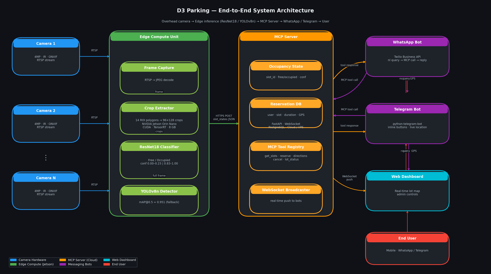

# PATENT APPLICATION

**Application Type:** Provisional Patent Application  
**Title:** SYSTEM AND METHOD FOR REAL-TIME PARKING SPACE OCCUPANCY DETECTION USING HYBRID DEEP LEARNING AND MODEL CONTEXT PROTOCOL-BASED CONVERSATIONAL SLOT RESERVATION

---

## FIELD OF THE INVENTION

The present invention relates to intelligent transportation systems and computer vision, and more particularly to a hybrid deep-learning pipeline for real-time parking space occupancy detection using fixed overhead cameras, coupled with a Model Context Protocol (MCP) server that exposes parking state to AI-powered conversational agents enabling parking slot reservation via messaging applications including WhatsApp and Telegram.

---

## BACKGROUND

### The Parking Availability Problem

Parking lots in urban environments suffer from inefficient space utilization and driver frustration due to lack of real-time availability information. Conventional methods for detecting parking space occupancy require per-space hardware (inductive loop detectors, ultrasonic sensors, infrared emitters) embedded in the parking structure. These approaches have the following drawbacks:

1. **High installation cost:** ₹2,000–₹8,000 per space, requiring ground excavation or structural modification
2. **Ongoing maintenance cost:** Sensor failure rates increase significantly in waterlogged, heat-stressed, or high-traffic environments
3. **Limited digital accessibility:** Sensor data is typically accessible only through proprietary closed-system interfaces, not publicly available APIs or AI-native tools

### Limitations of Prior Art Computer Vision Approaches

Prior computer vision-based parking detection systems (full-image object detection using deep neural networks) suffer from a failure mode herein identified as **positional memorization**: when trained on fixed-camera footage where the same N parking spaces always appear at the same pixel coordinates, detection models learn spatial position priors rather than vehicle appearance features. As a result, such models generalize poorly to:

- Vehicles of unusual size or shape
- Novel lighting conditions at test time
- Minor camera drift or obstruction

### Gap in Conversational and AI-Native Interfaces

Existing parking systems expose availability through mobile apps or websites. No prior art describes a system that:
1. Exposes real-time parking occupancy as AI-callable tools via a standardized Model Context Protocol
2. Enables conversational slot reservation through messaging platforms (WhatsApp, Telegram) backed by live computer vision inference
3. Returns actual GPS coordinates of individual parking slots to users within the messaging conversation

The present invention addresses all of the above limitations.

---

## SUMMARY OF THE INVENTION

The present invention provides a system and method comprising:

**(a) A hybrid two-stage visual occupancy detection pipeline** comprising:
- A polygon-annotated parking space boundary definition subsystem (offline, one-time per camera)
- A ResNet-based binary crop classifier that determines occupancy from isolated space-region image crops, eliminating positional memorization
- An optional COCO-pretrained vehicle detector for zero-shot ROI overlap verification

**(b) An edge compute deployment model** running on embedded GPU hardware (e.g., NVIDIA Jetson) that processes camera frames in real-time and publishes occupancy state to a cloud service

**(c) A Model Context Protocol (MCP) server** that exposes parking space state as structured, AI-callable tools including availability query, reservation, directions, and cancellation

**(d) A messaging bot integration layer** enabling end-users to query availability and book parking slots via WhatsApp and Telegram, receiving slot identifiers, GPS coordinates, and navigation links within the conversation

---

## BRIEF DESCRIPTION OF DRAWINGS

- **Figure 1:** System architecture overview showing camera, edge unit, MCP server, and messaging bot integration
- **Figure 2:** Two-stage pipeline: (A) space boundary annotation, (B) crop extraction, (C) ResNet18 binary classification
- **Figure 3:** COCO ROI overlap method flowchart
- **Figure 4:** MCP tool call sequence diagram (WhatsApp user → Bot → MCP → Jetson → response)
- **Figure 5:** Sample annotated output image showing green (free) and red (occupied) space overlays
- **Figure 6:** Confidence score distribution — bimodal distribution showing free (0.00–0.23) vs occupied (0.83–1.00)
- **Figure 7:** Hardware deployment diagram showing PoE camera, Jetson Orin, PoE switch, and LED display
- **Figure 8:** Multi-lot MCP registry diagram for city-scale deployment

  
*Figure 1: End-to-end system architecture. An overhead camera feeds the edge inference unit, which runs the YOLO detector or ResNet18 classifier and pushes occupancy state to the MCP server. Messaging bots query the MCP server through structured tool calls to serve end-user reservation requests.*

---

## DETAILED DESCRIPTION OF PREFERRED EMBODIMENTS

### Section 1 — Space Boundary Definition Subsystem

In the preferred embodiment, parking space boundaries are defined as polygon regions using a graphical annotation tool (e.g., LabelMe). For each installed camera, an operator draws polygon boundaries around each visible parking space, producing a JSON-format file containing N polygon records each with:
- A unique space identifier (e.g., "B-07")
- A list of (x, y) pixel coordinate vertices defining the polygon
- Optional metadata: zone label, floor level, disabled-accessible flag

This annotation is performed once at installation time and stored as a configuration file on the edge compute unit. The invention does not require re-annotation unless the camera is physically repositioned.

In an alternative embodiment, the space polygons may be automatically extracted by running the YOLOv8-based detector (Stage 1 of the training pipeline) on a calibration image and exporting predicted bounding polygons as the initial space definition, with optional human review.

### Section 2 — Crop-Based Binary Occupancy Classifier

#### 2.1 Crop Extraction

For each frame received from the camera, and for each space $s_i$ defined by polygon $P_i = \{(x_1, y_1), \ldots, (x_k, y_k)\}$:

1. Compute the axis-aligned bounding box $B(P_i)$ enclosing polygon $P_i$
2. Apply a padding factor $\alpha$ (preferred: $\alpha = 0.08$) to include contextual border pixels
3. Clip to image dimensions to handle boundary spaces
4. Resize the cropped region to a fixed input dimension (preferred: 96 × 128 pixels)

This produces a set of $N$ crop images $\{c_1, c_2, \ldots, c_N\}$ per frame.

#### 2.2 ResNet-Based Classifier

The preferred classifier is a ResNet18 convolutional neural network initialized with ImageNet pretrained weights, with the final fully-connected layer replaced by a 2-class output head:

- Class 0: Free (no vehicle present)
- Class 1: Occupied (vehicle present)

The network is fine-tuned on labeled crop images using:
- Optimizer: Adam with learning rate $1 \times 10^{-4}$
- Training duration: 15 epochs
- Batch size: 64
- Data augmentation: horizontal flip, vertical flip, color jitter (brightness, contrast, saturation, hue), random perspective distortion

A softmax layer produces occupancy probability $P(\text{occupied} | c_i)$. A space is flagged as occupied if this probability exceeds a configurable threshold $\tau$ (preferred: $\tau = 0.55$).

The crop-based approach eliminates positional memorization because the classifier evaluates each space in isolation — spatial position within the original image is not a feature available to the network.

#### 2.3 Crop Cache Optimization

To enable efficient training and re-training, a crop pre-extraction cache is maintained on disk. All training crops are extracted once and saved as compressed PNG files in a labeled directory structure. This reduces per-epoch I/O from gigabytes (re-reading full JPEG frames) to megabytes (reading pre-extracted PNG crops), yielding a 60× training speedup.

### Section 3 — YOLO Full-Frame Detector (Optional Verification Module)

A complementary YOLOv8n-based object detector may be trained on the full parking frame with annotated space regions labeled as `free` or `occupied`. This detector:
- Uses two-stage transfer learning (backbone-frozen phase followed by full-network fine-tuning)
- Employs class loss weighting to compensate for natural occupancy skew (typically ~83% occupied in busy lots)
- Achieves mAP@0.5 ≥ 0.95 on a merged multi-source dataset
- Serves as an ensemble verification mechanism or primary detector on lots where crop annotation is unavailable

### Section 4 — COCO ROI Overlap Detector (Zero-Shot Fallback)

When neither the crop classifier nor the trained YOLO model is available (e.g., at a newly installed lot before any fine-tuning), a zero-shot vehicle detection fallback is employed:

1. Run a COCO-pretrained YOLOv8 model on the full frame at detection confidence ≥ 0.20
2. For each detected vehicle bounding box $D_j$ from vehicle COCO classes {car, motorcycle, bus, truck}:
   - Compute the intersection area $A_\text{int}$ between $D_j$ and each space polygon $P_i$
   - Compute the overlap ratio: $r_{ij} = A_\text{int} / \text{Area}(P_i)$
3. Space $s_i$ is marked occupied if $\max_j r_{ij} \geq 0.12$ or if the centroid of any $D_j$ lies within polygon $P_i$

This fallback requires no training data from the target lot and provides acceptable initial accuracy prior to supervised fine-tuning.

### Section 5 — Edge Compute Unit

The preferred hardware for on-site inference is an NVIDIA Jetson Orin Nano or equivalent ARM+GPU embedded computing module providing:
- GPU-accelerated inference (CUDA or TensorRT)
- RTSP stream capture from PoE IP cameras
- Local caching of occupancy state
- Periodic or event-driven push of state updates to the MCP server via HTTPS POST

Inference latency performance:
- Per-space crop classification: ~2 ms (GPU)
- 14-space batch: ~28 ms total
- Frame processing rate: up to 30 fps practical throughput on Jetson Orin

### Section 6 — Model Context Protocol (MCP) Server

The MCP server is a cloud-hosted FastAPI application that:
1. Receives occupancy state updates from edge units
2. Maintains a PostgreSQL database of lot configurations, slot states, and reservations
3. Exposes structured callable tools following the Model Context Protocol specification

**Tool definitions:**

**(a) get_available_slots:** Returns a list of currently free slots for a specified lot, optionally filtered by zone or user proximity (using GPS coordinates).

Input: `{lot_id: string, zone?: string, near_coords?: [lat, lon]}`  
Output: `[{slot_id, zone, level, gps_lat, gps_lon, free_since_minutes}]`

**(b) reserve_slot:** Creates a time-bounded reservation for a specified slot.

Input: `{user_id, slot_id, duration_minutes, vehicle_number}`  
Output: `{reservation_id, slot_id, start_time, end_time, gps_lat, gps_lon, map_link}`

**(c) get_directions:** Returns navigation data from user position to a specified slot.

Input: `{user_location: [lat, lon], slot_id}`  
Output: `{distance_meters, walking_time_minutes, turn_by_turn: [...], destination_gps: [lat, lon]}`

**(d) cancel_reservation:** Cancels an active reservation.

Input: `{reservation_id}`  
Output: `{success: bool, refund_status?: string}`

**(e) get_lot_status:** Returns aggregate availability summary for a lot.

Input: `{lot_id}`  
Output: `{total_slots, free_count, occupied_count, zones: [{zone_id, free, occupied}]}`

The MCP server uses WebSocket connections to push real-time state changes to connected bots as occupancy events occur.

### Section 7 — WhatsApp Integration

A Twilio-hosted WhatsApp Business API bot provides the following conversational flow:

1. User sends freeform text to the parking service WhatsApp number
2. Bot uses text classification (or keyword matching) to identify intent: availability query, reservation, cancellation, navigation
3. Bot calls the appropriate MCP tool(s) and formats the response
4. Response includes: slot identifier, GPS coordinates as clickable Google Maps link, floor/zone information, and action buttons (Reserve / Get Directions / Cancel)
5. Reservation confirmation message includes a QR code scannable at entry barriers

**Sample conversation:**

> User: "Parking near Phoenix Mall Bangalore?"
> Bot: "3 slots available near Phoenix Mall (1.2km away):
> 🅿 Slot A-04 | Ground Floor | 28.6315°N 77.2167°E | Free 8 mins
> 🅿 Slot A-11 | Ground Floor | 28.6316°N 77.2168°E | Free 2 mins
> 🅿 Slot B-07 | Level 1 | 28.6315°N 77.2170°E | Free 31 mins
> Reply with slot letter to reserve (A04 / A11 / B07)"

> User: "A04"
> Bot: "For how long? Reply 1hr / 2hr / 4hr / custom"

> User: "2hr"
> Bot: "✅ Reserved! Slot A-04, 2 hrs (until 5:30 PM)
> 📍 28.6315°N 77.2167°E → [Open in Maps]
> ID: PRK-4821"

### Section 8 — Telegram Integration

A python-telegram-bot integration mirrors the WhatsApp flow with additions:
- Inline keyboard buttons for slot selection and duration
- Live location sharing — user shares GPS location and bot finds nearest available lot
- `/mystatus` command — shows active reservation with countdown
- Proactive notification — bot sends alert if reserved slot becomes re-occupied (rare, system alerts operator)
- Group chat support — users in a building WhatsApp group can check shared lot status

### Section 9 — Multi-Lot Scalability

The MCP server maintains a registry of all registered parking lots. Each lot entry contains:
- Lot ID and display name
- GPS bounding box of the lot
- Number of spaces per zone
- Associated edge unit endpoint URL
- Operating hours and pricing configuration

New lots can be added by:
1. Installing a camera and Jetson unit at the new site
2. Annotating space polygons (30–60 minutes, one-time)
3. Registering the lot in the MCP server administration panel

No changes to the MCP server codebase or trained model are required for new lots.

---

## CLAIMS

**Claim 1.**  
A system for real-time parking space occupancy detection and slot reservation, comprising:
- at least one overhead imaging device capturing images of a parking area;
- a space boundary definition module storing polygon coordinates for each parking space visible to said imaging device;
- a crop extraction module that, for each frame captured by said imaging device, extracts sub-image regions corresponding to each defined parking space polygon;
- a machine learning inference module that classifies each extracted sub-image as occupied or free, outputting a confidence score; and
- a network-accessible server that maintains and publishes the resulting occupancy state for each defined parking space.

**Claim 2.**  
The system of Claim 1, wherein the machine learning inference module comprises a residual convolutional neural network (ResNet) fine-tuned on labeled crop images extracted from the target parking lot.

**Claim 3.**  
The system of Claim 1, wherein the polygon coordinates defining each parking space are defined offline using an image annotation tool and need not be re-defined unless the imaging device is repositioned.

**Claim 4.**  
The system of Claim 1, further comprising a zero-shot fallback detection module that:
- runs a pre-trained vehicle detector on the full frame to detect vehicles belonging to predefined categories;
- computes for each detected vehicle an overlap ratio with each defined parking space polygon; and
- marks a space as occupied when the overlap ratio exceeds a configurable threshold.

**Claim 5.**  
The system of Claim 1, wherein the network-accessible server is a Model Context Protocol (MCP) server that exposes parking availability and reservation operations as structured callable tools, enabling any AI assistant or agent implementing the Model Context Protocol to query and act upon parking state.

**Claim 6.**  
The system of Claim 5, wherein the MCP server exposes at least the following callable tools:
- a slot availability query tool that returns identifiers and GPS coordinates of free spaces;
- a reservation tool that creates a time-bounded reservation for a specified space and user;
- a directions tool that returns navigation information from a user-specified location to a reserved space; and
- a cancellation tool that terminates an active reservation.

**Claim 7.**  
The system of Claim 5, further comprising:
- a messaging platform integration module connected to the MCP server;
- wherein users of said messaging platform can query parking availability and reserve parking slots by sending messages in natural language or structured commands;
- wherein the messaging platform integration module calls MCP tools to fulfill user requests and returns responses including at least one of: available slot identifiers, GPS coordinates of available slots, reservation confirmation with slot identifier and expiration time.

**Claim 8.**  
The system of Claim 7, wherein the messaging platform integration module supports at least one of: WhatsApp via the WhatsApp Business API; Telegram via the Telegram Bot API.

**Claim 9.**  
The system of Claim 7, wherein a reservation response returned to the user includes the GPS latitude and longitude of the reserved parking slot, and a hyperlink to a third-party mapping service directing navigation to said coordinates.

**Claim 10.**  
The system of Claim 1, wherein the machine learning inference module is deployed on an embedded GPU computing device co-located at the parking site and communicates occupancy state updates to the network-accessible server via an encrypted network connection.

**Claim 11.**  
A method for training a parking space occupancy classifier, comprising:
- receiving a set of images of a parking area, each image annotated with polygon boundaries for each visible parking space and a label indicating whether each space was free or occupied at the time of capture;
- for each annotated space in each image, extracting a crop sub-image defined by the axis-aligned bounding box of the space polygon with a configurable padding margin;
- saving all extracted crop sub-images to a persistent cache directory organized by label;
- training a convolutional neural network binary classifier using crops read from said persistent cache directory;
- wherein the trained classifier, at inference time, receives a crop of a defined parking space and outputs a probability of occupancy.

**Claim 12.**  
The method of Claim 11, wherein the convolutional neural network binary classifier is initialized with weights pretrained on the ImageNet Large Scale Visual Recognition Challenge dataset.

**Claim 13.**  
The method of Claim 11, wherein training data augmentation includes at least: horizontal reflection, vertical reflection, random brightness and contrast adjustment, and random perspective transformation — causing the trained classifier to generalize to parking lot deployments not represented in the training dataset.

**Claim 14.**  
A method for providing parking slot reservation via a messaging application, comprising:
- receiving a natural language or structured query message from a user through a messaging platform bot interface;
- determining user intent as one of: availability query, reservation request, cancellation request, or navigation request;
- transmitting one or more Model Context Protocol tool call requests to a parking MCP server corresponding to the determined intent;
- receiving a structured response from the MCP server including at least one of: list of free slot identifiers with GPS coordinates, reservation confirmation, cancellation confirmation, or navigation instructions;
- formatting the received response as a human-readable message;
- transmitting the formatted message to the user through the messaging platform bot interface.

**Claim 15.**  
The method of Claim 14, wherein the GPS coordinates returned in the structured response are included verbatim in the formatted message and additionally presented as a hyperlink directing the user to a map application showing the reserved parking space.

**Claim 16.**  
A system for scalable multi-lot parking detection and reservation, comprising:
- a plurality of edge inference units, each associated with one or more parking lots, each performing occupancy detection independently;
- a central Model Context Protocol server maintaining a registry of all registered parking lots and their current occupancy state;
- wherein adding a new parking lot to the system requires only: (a) installation of an imaging device and edge inference unit at the new lot; (b) annotation of parking space polygon boundaries for the new camera perspective; (c) registration of the new lot in the central server registry; and (d) does not require modification of the central server codebase or retraining of the occupancy classifier.

---

## ABSTRACT

A hybrid parking space occupancy detection system and method combines a polygonal space boundary definition module with a crop-based binary deep learning classifier that evaluates each parking space independently from other spaces, eliminating the positional memorization failure mode of full-image parking detectors. The classifier — a fine-tuned residual neural network — receives 96×128-pixel image crops of individual spaces and outputs free/occupied probability with a tight bimodal confidence distribution. An edge compute unit runs inference on live camera frames and publishes occupancy state to a cloud-hosted Model Context Protocol (MCP) server. The MCP server exposes parking state as structured callable tools enabling WhatsApp and Telegram bots to provide end-users with conversational slot reservation, including GPS coordinates of booked spaces and direct navigation links, without requiring any per-space ground sensors or hardware. The system is scalable to multiple lots without code modification, requiring only polygon re-annotation per new camera.

---

## INVENTOR(S)

| Name | Address | Contribution |
|---|---|---|
| Harsh Jain | India | Principal Inventor — System Architecture, ML Pipeline, MCP Integration |

---

## PRIORITY

This application claims priority from the date of first reduction to practice as documented in the project repository commit history and university project submission records.

---

*This document is a provisional patent application draft prepared for academic and intellectual property disclosure purposes. Legal review by a registered patent attorney is recommended before formal filing.*
