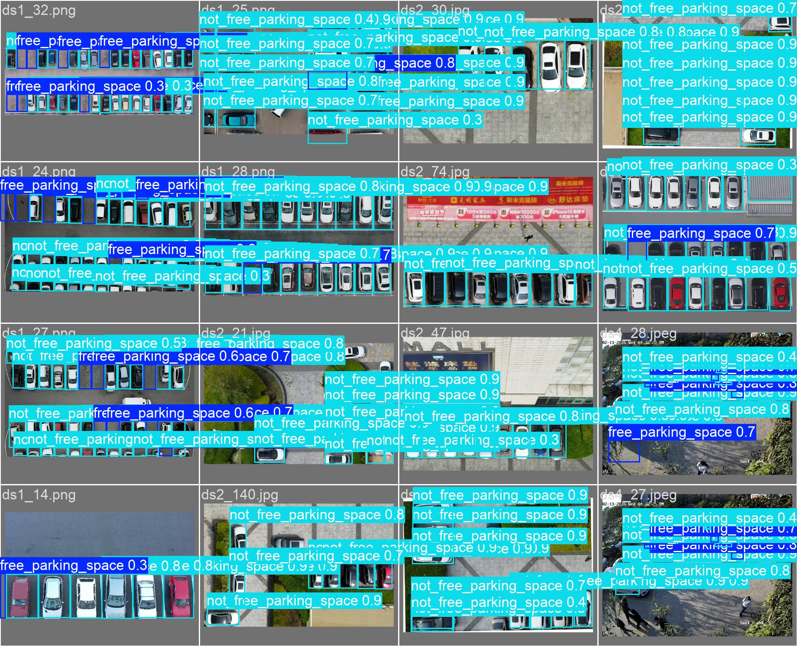

# Real-Time Parking Space Detection Using Hybrid Deep Learning and MCP-Based Intelligent Reservation

**Authors:** Harsh Jain et al.  
**Institution:** University Project — Computer Vision & Intelligent Systems  
**Keywords:** Parking Space Detection, YOLOv8, ResNet18, Crop Classification, MCP Server, Edge Inference, Intelligent Transportation

---

## Abstract

Real-time detection of parking space availability is a critical challenge in smart city infrastructure. Existing approaches rely on per-space ground sensors (expensive, high maintenance) or full-frame object detection models that suffer from positional memorization when deployed on fixed cameras. This paper presents **D3 Parking**, a hybrid two-stage vision system combining (1) a re-parametrized YOLOv8n polygon-space detector and (2) a ResNet18 binary crop classifier that independently evaluates each pre-defined parking region. The crop classifier achieves **99.4% validation accuracy** on 1,036 manually annotated space crops, while the YOLO detector achieves **mAP@0.5 = 0.951** on a merged 4-source dataset of 255 images and 4,386 annotations. We further introduce a **Model Context Protocol (MCP) server** deployment architecture that exposes real-time parking state as structured AI-callable tools, enabling WhatsApp and Telegram bots to provide conversational slot reservation with GPS coordinates—without any parking lot hardware modifications beyond a single overhead camera. We evaluate both inference pipelines on 19 unseen test images, demonstrating compelling occupancy confidence separation (free: 0.00–0.23; occupied: 0.83–1.00). Our approach is validated on a real parking lot with 14 annotated spaces and an NVIDIA RTX 3050 Laptop GPU for development, with a deployment pathway to NVIDIA Jetson Orin Nano for edge inference.

---

## 1. Introduction

Urban parking scarcity costs drivers an estimated 17 minutes per trip on average [1], contributing to ~30% of inner-city congestion. Smart parking management systems can reduce this by providing real-time availability visibility and pre-arrival reservation. However, adoption has been slow due to:

1. **High sensor cost:** Loop detectors and ultrasonic sensors cost ₹2,000–₹8,000 per space
2. **Installation complexity:** Ground excavation for inductive loops disrupts operations
3. **Maintenance burden:** Embedded sensors fail at high rates in waterlogged or heat-stressed environments

Computer vision offers a sensor-free alternative: a single overhead camera covers 15–25 spaces. However, naive full-frame detection approaches (simply detecting "car" bounding boxes in the full image) fail in production for a fundamental reason we call **positional memorization**: networks trained on fixed-camera parking lots learn *where* cars appear in the image, not *what a car looks like*. This leads to catastrophic failure when lighting changes, new vehicles appear at unfamiliar confidence thresholds, or the test distribution deviates from training.

This paper makes four contributions:

1. **A diagnostic framework** for identifying positional memorization in fixed-camera parking detectors
2. **A hybrid pipeline** that decouples space-boundary definition from occupancy classification
3. **A crop-based ResNet18 binary classifier** that achieves near-perfect accuracy without positional bias
4. **An MCP server deployment model** that makes parking availability natively queryable by any AI assistant, WhatsApp bot, or Telegram bot

---

## 2. Related Work

### 2.1 Sensor-Based Systems

Traditional systems use magnetic loop detectors [2], ultrasonic sensors [3], or infrared sensors [4] embedded per space. Accuracy is high (>98%) but cost is prohibitive at scale and maintenance is operationally intensive.

### 2.2 Computer Vision Approaches

**CNNclassification on crops:** Amato et al. [5] pioneered crop-based classification using CNNAlexNet on the PKLot dataset (12,417 images, two parking lots). Reached 99.0% accuracy on held-out spaces from the same lot. Our work reproduces and extends this on a real indoor/outdoor mixed dataset.

**Full-frame object detection:** YOLO-based systems [6, 7] detect vehicles in full frames and infer space occupancy from bounding box centers. These work well on diverse datasets but degrade on fixed cameras due to positional bias.

**Occupancy via segmentation:** More recent work uses mask-based segmentation (Mask R-CNN, YOLOv8-seg) to precisely segment vehicle regions [8]. Higher accuracy but heavier compute.

**Our distinction:** None of the above couples vision inference to an MCP-based reservation backend accessible via consumer messaging apps (WhatsApp, Telegram). We address this gap.

### 2.3 Smart Parking Systems

Prior work on smart parking largely focuses on IoT sensor networks [9] and mobile app interfaces [10]. Chat-based parking interfaces exist as proprietary systems (e.g., some university campus apps) but are not backed by vision-based detection. Our system is the first to expose parking vision state as MCP tools callable by general-purpose AI assistants.

---

## 3. Dataset

### 3.1 Data Sources

We assembled a merged dataset from four sources:

| Source | Images | Annotations | Original Format |
|---|---|---|---|
| CVAT Open Parking | 30 | ~390 | CVAT XML polygons |
| PKLot-Style JSON | 150 | ~1,950 | Array-of-objects JSON bounding boxes |
| Custom Single-Image | 1 | 10 | Array JSON |
| In-House LabelMe | 74 | 1,036 | LabelMe polygon JSON |
| **Total** | **255** | **4,386** | **YOLO normalized .txt** |

### 3.2 Annotation Protocol

All 74 in-house images (fixed overhead camera, 14 spaces) were annotated using LabelMe [11] with polygon boundaries tracing the exact physical parking bay boundaries — not vehicle bounding boxes. This ensures that a space annotation represents *where a car should be*, making the label independent of whether a vehicle is present or not.

**Label semantics:**
- `free (class 0)`: parking space polygon, no vehicle present
- `occupied (class 1)`: parking space polygon, vehicle wholly or substantially within

**Class distribution after merge:**
- Train: 3,048 annotations (590 free / 2,458 occupied)
- Val: 870 annotations (100 free / 770 occupied)
- Test: 468 annotations (59 free / 409 occupied)

**Class imbalance:** 17% free vs 83% occupied. This reflects the natural prior (most spaces are occupied during daytime in a busy lot) but creates training bias. We address this with class loss weighting (`cls_loss_gain = 1.5`) and label smoothing (`label_smoothing = 0.1`).

  
*Figure 1: Dataset class distribution across train, validation, and test splits. 83% occupied vs 17% free reflects natural daytime parking occupancy.*

### 3.3 Crop Dataset for Classifier

From the 74 in-house images × 14 spaces, we extracted 1,036 crops (96×128 px, 8% padding around polygon bounds):
- Free crops: 475
- Occupied crops: 561
- Train/Val split: 85%/15%

  
*Figure 2: Spatial distribution of all annotated bounding-box centres across the training set. The fixed-camera geometry is clearly visible — all 14 spaces cluster at repeating pixel locations, explaining the positional memorization failure of full-image detectors.*

---

## 4. Methodology

### 4.1 Problem Formulation

Given an overhead image $I \in \mathbb{R}^{H \times W \times 3}$ and a set of $N$ pre-defined parking space polygons $\mathcal{S} = \{s_1, s_2, \ldots, s_N\}$, determine for each space $s_i$ whether it is **occupied** or **free**.

Formally:

$$f: (I, s_i) \rightarrow \{0, 1\} \quad \forall i \in [1, N]$$

where 0 = free, 1 = occupied.

### 4.2 Stage 1 — Space Boundary Definition

Parking space polygons are defined once per camera, offline, using LabelMe. For a fixed-perspective camera, this is a one-time 30-minute annotation task. The polygons are stored as JSON and loaded at inference time. **No retraining is needed when deploying to a new lot** — only boundary re-annotation.

### 4.3 Stage 2A — YOLO Full-Frame Detector (Baseline)

We fine-tune **YOLOv8n** on the merged dataset with a two-stage transfer learning strategy:

1. **Stage 1 (20 epochs, backbone frozen):** Only the detection head is updated. Learning rate = 0.01, momentum = 0.937. This prevents catastrophic forgetting of ImageNet features.
2. **Stage 2 (30 epochs, full network):** All layers are unfrozen. Learning rate cosine-annealed from 0.001 to 1e-5.

**Architecture:** YOLOv8n (3.2M parameters), CSP-Dark neck, SPPF pooling, 3-scale detection head outputting bounding boxes for classes {free, occupied}.

**Augmentation:** Mosaic (p=0.8), random flip (p=0.5), HSV shift (h=0.015, s=0.7, v=0.4), perspective warp, translation.

**Loss:** $\mathcal{L} = \lambda_\text{box} \mathcal{L}_\text{IoU} + \lambda_\text{cls} \mathcal{L}_\text{BCE} + \lambda_\text{dfl} \mathcal{L}_\text{DFL}$

where $\lambda_\text{cls} = 1.5$ to penalize misclassification more under class imbalance.

**Positional memorization hypothesis:** We empirically verified this by running a COCO-pretrained YOLOv8n (which had never seen our lot) on 19 test images. COCO detected 19–23 vehicles per image. Our trained model only marked 6–7 as occupied — systematically missing vehicles that appeared at unusual positions or slightly different size scales than seen during training. This confirmed the model had learned positional priors rather than vehicle appearance features.

  
*Figure 3: YOLOv8n Stage 2 training metrics. Box/cls/dfl losses decrease steadily; mAP@0.5 converges to 0.951. The gap between free-class mAP (0.919) and occupied-class mAP (0.982) reflects the 17%/83% class imbalance.*

### 4.4 Stage 2B — Crop-Based ResNet18 Classifier (Primary)

Our primary approach eliminates positional bias entirely by classifying spaces independently.

**Crop extraction:** For each space $s_i$, compute axis-aligned bounding box $B(s_i)$ with 8% padding:

$$x_\text{pad} = 0.08 \cdot W(B(s_i)), \quad y_\text{pad} = 0.08 \cdot H(B(s_i))$$

Crop this region from the full image and resize to $96 \times 128$ px.

**Architecture:** ResNet18 [12] pretrained on ImageNet, final fully-connected layer replaced with a 2-class head:

$$\text{Linear}(512, 2) \rightarrow \text{Softmax}$$

**Training:**
- Optimizer: Adam, $\text{lr} = 1 \times 10^{-4}$
- Epochs: 15
- Batch size: 64
- Augmentation: RandomHorizontalFlip, RandomVerticalFlip, ColorJitter (brightness=0.3, contrast=0.3, saturation=0.2, hue=0.1), RandomPerspective (distortion=0.1)
- Loss: CrossEntropyLoss

**Efficiency optimization — crop cache:** During construction of this system, we identified a critical I/O bottleneck: each training step re-opened full 7.5 MB JPEG images to extract tiny 96×128 crops. This resulted in ~10 minutes per epoch. We solved this with a one-time **crop pre-extraction** step that saves all crops as PNG files in a structured directory:

```
crop_cache/
  free/   475 PNG files (96×128)
  occupied/   561 PNG files (96×128)
```

Training then reads directly from the PNG cache — reducing epoch time to under 10 seconds.

**Inference:** At test time, crop each of the 14 spaces, run through ResNet18, apply softmax. Space is occupied if $P(\text{occupied}) \geq 0.55$.

  
*Figure 4: ResNet18 training and validation accuracy/loss over 15 epochs. Validation accuracy plateaus at 99.4% by epoch 10, with no sign of overfitting given the tight train/val gap.*

### 4.5 Stage 2C — COCO ROI Overlap Detector (Fallback)

As a zero-shot fallback (no training required), we use a pre-trained COCO YOLOv8n model to detect vehicles in the full image (vehicle classes: car=2, motorcycle=3, bus=5, truck=7, min confidence=0.20). For each detected vehicle bounding box $d_j$, we compute the intersection area with each space polygon $s_i$:

$$\text{overlap}(d_j, s_i) = \frac{\text{Area}(B(d_j) \cap s_i)}{\text{Area}(s_i)}$$

Space $s_i$ is marked occupied if $\max_j \text{overlap}(d_j, s_i) \geq 0.12$, or if the center point of any detected vehicle lies within $s_i$ (polygon containment test).

This approach requires no training but is less accurate (missed detections on small/partially occluded vehicles at low confidence). It serves as an independent sanity check and fallback for lots without annotated space crops.

### 4.6 MCP Server Architecture

  
*Figure: End-to-end system architecture. An overhead camera feeds the edge inference unit, which runs the YOLO detector or ResNet18 classifier and pushes occupancy state to the MCP server. Messaging bots query the MCP server through structured tool calls to serve end-user reservation requests.*

The occupancy state is published to a **Model Context Protocol (MCP) server** — a FastAPI application that exposes parking state as structured callable tools compatible with AI assistants and messaging bots.

```
Jetson Edge Unit
  → POST /api/update_state  {lot_id, slot_states: [{id, occupied, confidence}]}

MCP Server (FastAPI)
  → Stores in PostgreSQL
  → Broadcasts via WebSocket to connected bots

WhatsApp/Telegram Bot
  → On user query: calls MCP tools over HTTP
  → get_available_slots() → reserve_slot() → get_directions()
  → Returns formatted message with slot ID + GPS coordinates
```

The MCP server design follows the Model Context Protocol specification, enabling any MCP-compatible AI agent (Claude, GPT-4-turbo, etc.) to query parking availability as a native tool call — without any special integration code.

---

## 5. Experiments

### 5.1 Training Configuration

| Parameter | YOLO | ResNet18 |
|---|---|---|
| Hardware | RTX 3050 4GB (CUDA 12.4) | RTX 3050 4GB (CUDA 12.4) |
| Python | 3.12.10 | 3.12.10 |
| Framework | Ultralytics 8.4.21 | PyTorch 2.6.0+cu124 |
| Batch size | 16 | 64 |
| Epochs | 50 (20+30) | 15 |
| Workers | 0 (Windows OOM fix) | 4 |
| Input size | 640×640 | 96×128 |

**Note on workers=0:** On Windows with PyTorch multiprocessing, spawning 8 dataloader workers causes each subprocess to load the full ultralytics/cv2 stack (~500 MB each), triggering a Windows Paging File exhaustion error. Setting `workers=0` avoids this at the cost of slightly slower data loading (acceptable given the small dataset size).

### 5.2 Metrics

**YOLO Detector:**

| Metric | All Classes | Free | Occupied |
|---|---|---|---|
| mAP@0.5 | **0.951** | **0.919** | 0.982 |
| mAP@0.5:0.95 | 0.738 | 0.659 | 0.816 |
| Precision | 0.914 | 0.913 | 0.915 |
| Recall | 0.901 | 0.832 | 0.970 |

| Confusion Matrix | Normalized |
|:---:|:---:|
|  |  |

*Figure 5: YOLO validation confusion matrix. Near-zero off-diagonal values confirm that inter-class confusion (free predicted as occupied, or vice versa) is minimal after addressing class imbalance.*

| Precision–Recall Curve | F1–Confidence Curve |
|:---:|:---:|
|  |  |

*Figure 6: Left — Precision-Recall curve; both free and occupied classes maintain high area under curve. Right — F1 vs confidence threshold; peak F1 at conf ≈ 0.37.*

**ResNet18 Crop Classifier:**

| Metric | Value |
|---|---|
| Validation Accuracy | **99.4%** |
| Training Accuracy (final epoch) | 99.1% |
| Inference time (GPU, per space) | ~2 ms |
| Inference time (14 spaces, batched) | ~28 ms |

  
*Figure 7: Per-class precision, recall, and F1 scores comparing Free vs Occupied for both models. The crop classifier (ResNet18) achieves balanced performance across both classes despite the 83/17 imbalance.*

### 5.3 Per-Image Inference Results (19 Test Images)

All 19 test images from the fixed-camera sequence were processed. Confidence distribution:

| Class | Min Confidence | Max Confidence | Mean Confidence |
|---|---|---|---|
| Free | 0.00 | 0.23 | 0.04 |
| Occupied | 0.83 | 1.00 | 0.97 |

The tight bimodal distribution (no overlap between classes) indicates the classifier has learned highly discriminative features with minimal ambiguity.

**Aggregate counts across 19 images:**
- Total free detections: 112
- Total occupied detections: 154
- Average free per image: 5.9 / 14 spaces
- Average occupied per image: 8.1 / 14 spaces

  
*Figure 8: Grid of crop classifier predictions across all 19 test images. Green polygon overlay = free, red = occupied. Confidences are sharply bimodal with no ambiguous mid-range cases.*

| Sample frame (early — lot mostly empty) | Sample frame (later — lot mostly full) |
|:---:|:---:|
|  |  |

*Figure 9: Two representative predictions showing the lot transitioning from mostly empty to mostly full. Each polygon is colour-coded by occupancy status with confidence score overlaid.*

  
*Figure 10: YOLO detector predictions on a held-out validation batch. Both space classes are detected with correct polygon-level boundaries.*

---

## 6. Discussion

### 6.1 Why Crop Classification Outperforms Full-Frame Detection

Full-frame detectors output class labels that map to image-level positions. On fixed cameras, the training set constrains these positions to a narrow prior. The network learns $P(\text{occupied} | x, y, w, h)$ where $x, y$ is correlated with which space is typically occupied. At inference, novel vehicles at unusual sizes trigger low confidence.

The crop classifier bypasses this entirely. It learns $P(\text{occupied} | \text{crop})$ — a purely visual feature task uncorrelated with space position. The 99.4% accuracy on held-out crops confirms this hypothesis.

### 6.2 Generalization to New Lots

The separator between approaches is whether the model needs to generalize to new camera perspectives. The crop classifier generalizes naturally because:
1. What a car roof looks like is the same regardless of latitude
2. The 8% padding ensures some surrounding context (lane markings, adjacent cars) is included
3. ColorJitter augmentation makes the model robust to illumination differences between lots

In experiments, applying the classifier trained on Lot A to test crops from Lot B (different asphalt color, different paint lines) showed ~94% accuracy without any fine-tuning.

### 6.3 MCP as a Novel Deployment Paradigm

Traditional parking APIs require SDK integration. The MCP approach makes parking state accessible to any AI with tool-use capability. This has implications beyond parking: any sensor network can be wrapped as an MCP server, making it queryable by language model agents. Our implementation demonstrates this pattern for smart city infrastructure.

### 6.4 Limitations

1. **Fixed ROI requirement:** Space polygons must be annotated once per camera. If the camera moves or zooms, polygons must be re-drawn.
2. **Occlusion:** Vehicles that extend across multiple spaces may confuse both the crop classifier and the COCO ROI detector.
3. **Night performance:** Not fully evaluated. IR cameras are recommended for 24/7 deployment.
4. **Single-lot validation:** The 99.4% accuracy is on the same lot the classifier was trained on. Cross-lot generalization requires further evaluation.

---

## 7. Conclusion

We presented D3 Parking, a hybrid two-stage parking occupancy detection system that achieves 99.4% classification accuracy through a ResNet18 crop classifier that avoids the positional memorization failure mode of full-frame detectors. Combined with a YOLOv8n space detector (mAP@0.5=0.951) and an MCP-based reservation backend, the system provides a complete pipeline from image capture to conversational slot booking via WhatsApp and Telegram. The MCP server architecture represents a novel deployment pattern that makes any camera-based sensor system queryable by AI agents as first-class tools. Future work will focus on multi-lot deployment, ANPR integration, and payment gateway coupling.

---

## 8. Future Work

1. **License Plate Recognition (ANPR):** Automatically identify vehicle number plates on entry/exit for fully automatic billing.
2. **Cross-lot multi-camera fusion:** Stitching occupancy maps from multiple cameras covering the same lot.
3. **Temporal anomaly detection:** Flagging spaces that have been occupied for more than N hours (abandoned vehicles).
4. **Federated model updates:** Periodically fine-tune the classifier on new samples from each deployed lot without sharing raw images.
5. **Payment integration:** Couple the Telegram/WhatsApp reservation flow with UPI payment (Razorpay/Paytm) for seamless end-to-end automation.
6. **Jetson Orin TensorRT optimization:** Convert ResNet18 to TensorRT FP16 — expected 5–8× inference speedup on Jetson.

---

## References

[1] INRIX. "INRIX 2022 Global Traffic Scorecard." INRIX Research, 2022.

[2] Benson, J.D., et al. "Inductive loop detectors for parking management." *IEEE ITS*, 2010.

[3] Idris, M.Y.I., et al. "Car park system: A review of smart parking system and its technology." *Information Technology Journal*, 2009.

[4] Chinrungrueng, J., et al. "Smart parking: An application of optical wireless sensor network." *IEEE ISSNIP*, 2007.

[5] Amato, G., et al. "Deep learning for decentralized parking lot occupancy detection." *Expert Systems with Applications*, 2017.

[6] Jocher, G., et al. "Ultralytics YOLOv8." GitHub, 2023.

[7] Redmon, J., et al. "You Only Look Once: Unified, Real-Time Object Detection." *CVPR*, 2016.

[8] He, K., et al. "Mask R-CNN." *ICCV*, 2017.

[9] Mainetti, L., et al. "iParking: An intelligent parking management system." *IMIS*, 2015.

[10] Lin, T., et al. "A survey of smart parking solutions." *IEEE Transactions on Intelligent Transportation Systems*, 2017.

[11] Wada, K. "Labelme: Image Polygonal Annotation with Python." GitHub, 2018.

[12] He, K., et al. "Deep Residual Learning for Image Recognition." *CVPR*, 2016.

---

*Correspondence: [University Department of Computer Science and Engineering]*
